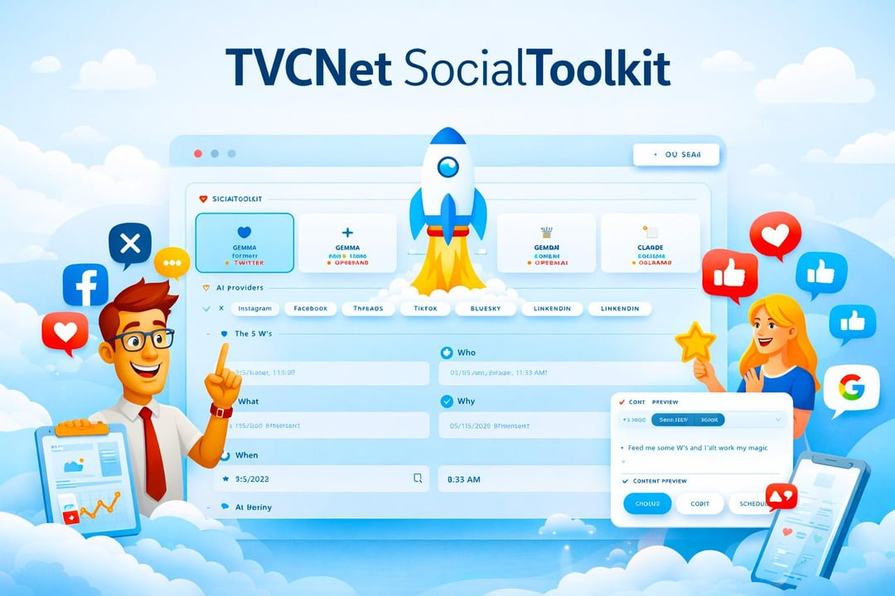

  

  

# TVCNet SocialToolkit v4.7.6 — AI-Powered Social Media Toolkit

### AI-Powered Social Media Toolkit for Nonprofits & Small Businesses

> **Free. Browser-Based. Built for nonprofits and small businesses.**
> Generate social media posts using the AI provider of your choice — no subscription, no login, no data collection.

---

## Table of Contents

- [What is the SocialToolkit?](#what-is-the-social-toolkit)
- [Who Is It For?](#who-is-it-for)
- [Features](#features)
- [Supported Platforms](#supported-platforms)
- [Supported AI Providers](#supported-ai-providers)
- [Getting Started](#getting-started)
- [Using Ollama (Local AI)](#using-ollama-local-ai)
- [Content Calendar & CSV Export](#content-calendar--csv-export)
- [Privacy & Security](#privacy--security)
- [Credits & Inspiration](#credits--inspiration)
- [FAQ](#faq)
- [Contributing](#contributing)
- [License](#license)

---

## What is the SocialToolkit?

## How It Works: Browser-First Privacy

SocialToolkit is a bit different from most tools. Instead of your data living on a server in some far-off data center, everything stays right on your own machine. It's a single HTML file—no database, no backend, no middleman.

Built on the 5 W's Framework (Who, What, Where, Why, When), SocialToolkit transforms your raw context into polished, platform-specific content in seconds. Because it runs entirely in your browser, your API keys and your drafts never touch the cloud or outside servers. You're in total control of your data.

---

## Who Is It For?

SocialToolkit was built specifically for:

- Nonprofit organizations — Tell your mission-driven stories consistently without a dedicated marketing team or budget.
- Small businesses — Maintain a professional social media presence without paying $50–$300/month for enterprise tools.
- Solo operators — Founders, executive directors, and owner-operators who wear every hat and need to move fast.
- Community advocates — Anyone with an important story to tell and limited time to tell it.

---

## Who Is It Not For?

I'll be honest—SocialToolkit isn't for everyone. It's built for a specific kind of focused work.

- **Enterprise marketers** — If you need to manage 50 different accounts and have a $20,000/month tool budget, you’re in the wrong place.
- **Auto-posters** — TVCNet SocialToolkit is a privacy-first *drafting* and *planning* assistant. **It does not ask for your passwords, it does not connect to your social media accounts, and it cannot post on your behalf**. It helps you generate and format posts to the perfect length, but you must copy/paste them or export your calendar to a third-party tool to actually publish them.
- **Data collectors** — If you want a tool that tracks your every move and sells your engagement metrics, you won't find that here.
- **The "Complex-is-Better" Crowd** — If you love dashboards with 500 buttons and dials, you’re going to find this tool way too simple. And I’m okay with that.

---

## Features

| Feature | Details |
|---|---|
| Multi-AI Support | Claude 3.5 Haiku, GPT-5 Nano, Gemma 3 27B, and local Ollama models |
| 7 Platforms | X, Instagram, Facebook, Threads, TikTok, Bluesky, LinkedIn |
| Activity Log | Real-time terminal-style feed of all generation, copy, and scheduling events |
| Custom Instructions | Save persistent writing rules (e.g., "Always use formal tone," "No hashtags") |
| 5 W's Framework | Structured storytelling with vibrant icons and color signatures |
| Auto-Sized Posts | Each post is written to the exact character limit of the chosen platform |
| Direct Intent URLs | **[NEW!]** One-click "Post directly" button for supported platforms (X, LinkedIn, Bluesky) to open the native compose box with text pre-filled |
| CSV Export | Export your full content calendar for use in spreadsheets or scheduling tools |
| Clean Architecture | **[NEW!]** Fully decoupled UI (Alpine.js) from Business Logic (AIService) and Storage (StorageManager) |
| Interactive Help | **[NEW!]** 22 strategic guidance points integrated across every panel for content optimization |
| Persistent Sync | Ollama models and settings persist across refreshes and hardware restarts |
| Full Privacy | All data stays in your browser — nothing is sent to any external server |
| Completely Free | No subscription, no freemium tier, no hidden costs |

---

## Supported Platforms

| Platform | Character Limit | Writing Style |
|---|---|---|
| X | 280 | Punchy, hook-driven, tight CTAs |
| Instagram | 2,200 | Story-forward, emoji-rich, hashtag block |
| Facebook | 63,206 | Conversational, community-focused |
| Threads | 500 | Authentic, casual, hot-take friendly |
| TikTok | 2,200 | Fast-paced, Gen-Z aware, trending hashtags |
| Bluesky | 300 | Conversational, tech-aware, authentic |
| LinkedIn | 3,000 | Long-form professional, first-person authority |
|
| > **Note:** Platforms with a green indicator line in the toolkit (X, LinkedIn, Bluesky) support the **Post Directly** feature.

---

## Supported AI Providers

SocialToolkit works with four AI providers. You can switch between them at any time.

### Google (Gemma 3 27B)
- Requires: A Gemini API key from <a href="https://aistudio.google.com/app/apikey" target="_blank" rel="noopener" title="Get Gemini API Key (opens in new window)">aistudio.google.com/app/apikey</a>
- Model ID: `gemma-3-27b-it`

### OpenAI (GPT-5 Nano)
- Requires: An OpenAI API key from <a href="https://platform.openai.com/api-keys" target="_blank" rel="noopener" title="Get OpenAI API Key (opens in new window)">platform.openai.com/api-keys</a>
- Cost: Pay-per-use via OpenAI's API pricing

### Claude (Anthropic)
- Requires: An Anthropic API key from <a href="https://console.anthropic.com/api-keys" target="_blank" rel="noopener" title="Get Anthropic API Key (opens in new window)">console.anthropic.com/api-keys</a>
- Cost: Pay-per-use via Anthropic's API pricing

### Ollama (Local Models)
- Requires: <a href="https://ollama.com" target="_blank" rel="noopener" title="Visit Ollama.com (opens in new window)">Ollama</a> installed and running on your machine
- Cost: Completely free — no API fees, no internet required
- Privacy: Your content never leaves your device

---

## Getting Started

SocialToolkit requires no installation. It runs as a single HTML file in any modern browser.

Step 1 — Download
Download tvcnet-social-toolkit.html and save it anywhere on your computer.

Step 2 — Open in Browser
Double-click tvcnet-social-toolkit.html, or drag it into Chrome, Firefox, or Edge.

Step 3 — Add Your API Key
Click API Keys in the top-right corner. Add your API key for your preferred AI provider and click Save Keys.

Step 4 — Select Your Provider & Platform
Click the AI provider card you want to use, then click the platform pill for where you will be posting.

Step 5 — Fill In the 5 W's
Provide context for Who, What, Where, Why, and When. Add optional hashtags and select a tone.

Step 6 — Generate
Click Generate Post. Your AI-written post appears in the preview pane. Copy it, edit it, or add it directly to your content calendar.

---

## Using Ollama (Local AI)

Ollama allows you to run AI models entirely on your own computer.

Setup:
1. Open Ollama (ensure the app is running in your menu bar/system tray).
2. By default, the server runs at http://127.0.0.1:11434.
3. In SocialToolkit, click API Keys.
4. Confirm the Server URL and click Fetch.
5. Select your desired model from the dropdown and click Save Keys.
   - *Optional:* If you store your models on an external drive, enter the full path in the **Models Path** field.
6. Click the Ollama provider card to activate it.

### Troubleshooting: "Address already in use" (Mac)
If you try to run `OLLAMA_ORIGINS="*" ollama serve` in your terminal and get an error like `bind: address already in use`, it means the Mac Ollama app is already running silently in the background and hogging that port.

**The Fix:**
1. Look up at your Mac's top menu bar (near your WiFi/Clock icons) and find the little Llama icon.
2. Click it and select **Quit Ollama**.
3. Now that the port is free, run your terminal command again. It should fire right up!

**Still not working?**
If quitting the app didn't work, a background process might be stuck. Open your terminal and run `killall Ollama` to quickly force-close any hidden Ollama instances. 

Then run the following command (replacing everything after the `=` with your custom path if using one):
`OLLAMA_ORIGINS="*" OLLAMA_MODELS="/your/custom/path" ollama serve`

---

## Content Calendar & CSV Export

SocialToolkit includes a lightweight content calendar to help you plan posts in advance.

To schedule a post:
1. Generate a post you are happy with.
2. Set a Publish Date and Publish Time in the Schedule section.
3. Click Add to Content Calendar.

To export:
Click Export CSV to download your full calendar as a .csv file compatible with Excel, Google Sheets, Airtable, or any scheduling tool that accepts CSV imports.

Note: The content calendar is stored in your browser's local storage. Clearing your browser data will clear the calendar. Use **Export Calendar (CSV)** for a spreadsheet-ready record of your posts, or **Backup All API Settings** in the Settings menu to save everything (including API keys).

---

**Important:** If you "Clear Browser Data," "Clear Cache," or use a "Cleaner" app, you will likely wipe out your API keys and Content Calendar. Think of it like a sticky note on your monitor—if you throw it away, it's gone. 

I highly recommend using the **Backup All API Settings** feature inside the **API Keys** menu. This creates a small `.json` file you can save to your computer. If you ever lose your data, just click **Restore** and select that file. It’s like having an insurance policy for your hard work. Probably best to not share this file on social media.

---

## Privacy & Security (The Jim Walker Way)

As a product of TVCNet, security isn't just a feature—it’s our baseline. I built this tool to be the safest way to use AI, period.

- **No account required** — I don't need your email, and I certainly don't need your password.
- **No data collection** — SocialToolkit doesn’t watch what you write. 
- **No analytics** — No tracking pixels, no "telemetry," and no third-party scripts.
- **API keys stay local** — Your keys are stored in your browser's *local storage*. They are encrypted by your browser and never sent to us.
- **No server** — This is a static HTML file. There is no backend to hack.

---

## Credits & Inspiration

The TVCNet SocialToolkit is a community-focused project brought to you by the team at TVCNet.

- Lead Developer: Jim Walker (<a href="https://hackrepair.com" target="_blank" rel="noopener" title="Visit HackRepair.com (opens in new window)">hackrepair.com</a>) @hackrepair — The Hack Repair Guy
- TVCNet SocialToolkit was created by Jim Walker. Original concept was inspired by Bobby Taylor's [PostCraft](https://github.com/bobbyrtaylor2/PostCraft/)
- TVCNet References: <a href="https://www.reddit.com/r/tvcnet/comments/1rummzc/tvcnet_socialtoolkit_made_for_tvcnet_website/" target="_blank" rel="noopener" title="Visit TVCNet on Reddit (opens in new window)">reddit.com/r/tvcnet</a>

---

## FAQ

Do I need to pay to use SocialToolkit?
SocialToolkit itself is completely free. You will pay only for the AI API calls you make — and only if you exceed the free tier of your chosen provider. Google Gemini offers a generous free tier. Ollama is entirely free.

Can I use it offline?
Yes, if you use Ollama as your AI provider. The HTML file itself works offline — only the AI generation requires a connection (unless using Ollama locally).

Is my content safe?
Your content is sent only to the AI provider you select. SocialToolkit itself never sees or stores your content.

Can I modify this tool for my own use?
Please do! And be sure to post your changes in our forum at <a href="https://www.reddit.com/r/tvcnet/comments/1rummzc/tvcnet_socialtoolkit_made_for_tvcnet_website/" target="_blank" rel="noopener" title="Visit TVCNet on Reddit (opens in new window)">reddit.com/r/tvcnet</a>

---

## License

The TVCNet SocialToolkit is released as a free tool for nonprofit organizations and small businesses. You are free to use, share, and modify it for non-commercial purposes. Attribution is appreciated but not required.

---

**[Visit TVCNet.com](https://tvcnet.com)** *Secure Hosting. Human Support. Better Tools.*

